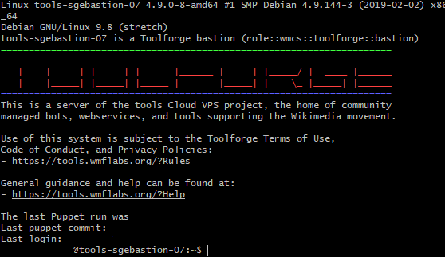
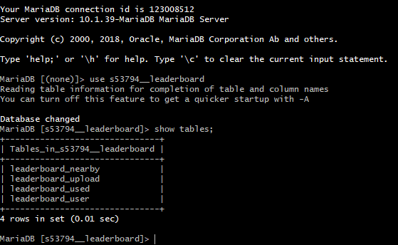
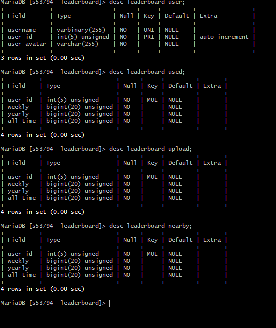

# Leaderboard DB Schema

## Access Database and Schema
This database is available at `https://toolsadmin.wikimedia.org/tools/id/commons-android-app`

- You need to first generate a SSH public and private key and then add it to your tools account.

After that run the following commands

- ```$ eval `ssh-agent -s` ```

- `$ ssh-add key` where key is the name of your private key

- `$ ssh username@tools-login.wmflabs.org` where username is your username

  

- `$ become commons-android-app`

- `$ sql tools`

- `$ use s53794__leaderboard` where **s53794__leaderboard** is the name of database

- `> show tables;`

  

  ```
  MariaDB [s53794__leaderboard]> show tables;
  +-------------------------------+
  | Tables_in_s53794__leaderboard |
  +-------------------------------+
  | leaderboard_nearby            |
  | leaderboard_upload            |
  | leaderboard_used              |
  | leaderboard_user              |
  +-------------------------------+
  4 rows in set (0.01 sec)

  ```

- `> desc leaderboard_user;`

- `> desc leaderboard_used;`

- `> desc leaderboard_upload;`

- `> desc leaderboard_nearby;`

  

  ```
  MariaDB [s53794__leaderboard]> desc leaderboard_user;
  +-------------+-----------------+------+-----+---------+----------------+
  | Field       | Type            | Null | Key | Default | Extra          |
  +-------------+-----------------+------+-----+---------+----------------+
  | username    | varbinary(255)  | NO   | UNI | NULL    |                |
  | user_id     | int(5) unsigned | NO   | PRI | NULL    | auto_increment |
  | user_avatar | varchar(255)    | NO   |     | NULL    |                |
  +-------------+-----------------+------+-----+---------+----------------+
  3 rows in set (0.00 sec)

  MariaDB [s53794__leaderboard]> desc leaderboard_used;
  +----------+---------------------+------+-----+---------+-------+
  | Field    | Type                | Null | Key | Default | Extra |
  +----------+---------------------+------+-----+---------+-------+
  | user_id  | int(5) unsigned     | NO   | MUL | NULL    |       |
  | weekly   | bigint(20) unsigned | NO   |     | NULL    |       |
  | yearly   | bigint(20) unsigned | NO   |     | NULL    |       |
  | all_time | bigint(20) unsigned | NO   |     | NULL    |       |
  +----------+---------------------+------+-----+---------+-------+
  4 rows in set (0.01 sec)

  MariaDB [s53794__leaderboard]> desc leaderboard_upload;
  +----------+---------------------+------+-----+---------+-------+
  | Field    | Type                | Null | Key | Default | Extra |
  +----------+---------------------+------+-----+---------+-------+
  | user_id  | int(5) unsigned     | NO   | MUL | NULL    |       |
  | weekly   | bigint(20) unsigned | NO   |     | NULL    |       |
  | yearly   | bigint(20) unsigned | NO   |     | NULL    |       |
  | all_time | bigint(20) unsigned | NO   |     | NULL    |       |
  +----------+---------------------+------+-----+---------+-------+
  4 rows in set (0.00 sec)

  MariaDB [s53794__leaderboard]> desc leaderboard_nearby;
  +----------+---------------------+------+-----+---------+-------+
  | Field    | Type                | Null | Key | Default | Extra |
  +----------+---------------------+------+-----+---------+-------+
  | user_id  | int(5) unsigned     | NO   | MUL | NULL    |       |
  | weekly   | bigint(20) unsigned | NO   |     | NULL    |       |
  | yearly   | bigint(20) unsigned | NO   |     | NULL    |       |
  | all_time | bigint(20) unsigned | NO   |     | NULL    |       |
  +----------+---------------------+------+-----+---------+-------+
  4 rows in set (0.00 sec)
  ```

## Create Database

```
$ sql tools

> CREATE DATABASE CREDENTIALUSER__DBNAME;

```

For Example

```
> CREATE DATABASE s53794__leaderboard;
```
Note: make sure to use `__` double underscore


## To Create Tables Run a SQL file like

```
$ mysql -u root -p --no-data dbname > create_leaderboard_tables.sql
```

## Pull from Repo

```
$ become commons-android-app

$ cd public_html/tool-commons-android-app

$ git pull origin master

```

## Create config.yaml

```
$ nano config.yaml
```

Example config.yaml file
```
DB_HOST: tools.db.svc.eqiad.wmflabs
DB_USER: s53794
DB_PASS: {your_password}
DB_NAME: s53794__leaderboard
```

## Start API Webservice

```
$ webservice --backend=gridengine lighttpd start
```

## Make Cron Job

```
$ crontab -e
```

Example cronjob to refresh leaderboard after every 2 hours
```
0 */2 * * * cd public_html/tool-commons-android-app/scripts/refresh_leaderboard && /usr/bin/python3.5 refresh_leaderboard.py >> output.out
```